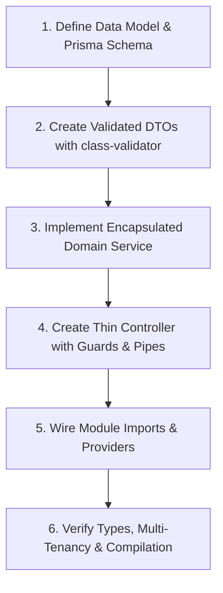

# NestJS High-Quality Backend Development Skill

This skill defines the engineering workflow, structural patterns, and live coding standards for writing production-grade NestJS backend code. It ensures that every new line of code adheres to strict type safety, input validation, multi-tenancy isolation, and error resilience.

---

## 1. On-The-Spot Feature Construction Workflow

When implementing any backend feature or modification, follow this 6-step lifecycle:



### Step 1: Data Model & Persistence
- If modifying schemas in `prisma/schema.prisma`:
  - Ensure all user-owned entities have `userId String` with a relation to `User` (`onDelete: Cascade`) and `@@index([userId])`.
  - For SQLite JSON text fields, define a matching TypeScript interface and use safe parsers.
  - Run `pnpm exec prisma generate` immediately after schema updates.

### Step 2: DTOs & Input Validation
- **Never use inline TypeScript types in `@Body()`, `@Query()`, or `@Param()`**.
- Create a dedicated DTO class with `class-validator` and `class-transformer` decorators.
- Example:
  ```typescript
  import { IsString, IsNotEmpty, IsOptional, IsInt, Min, Max } from 'class-validator';
  import { Type } from 'class-transformer';

  export class CreateResourceDto {
    @IsString()
    @IsNotEmpty()
    title: string;

    @IsOptional()
    @Type(() => Number)
    @IsInt()
    @Min(1)
    @Max(100)
    limit?: number;
  }
  ```

### Step 3: Service Layer (Business Logic & Isolation)
- Keep services single-responsibility; avoid monolithic files (>300 lines).
- **Mandatory User Scoping**: Filter all database operations by `userId`:
  ```typescript
  const item = await this.prisma.item.findFirst({
    where: { id, userId },
  });
  if (!item) throw new NotFoundException('Item not found');
  ```
- **Prisma Transactions**: Wrap multi-table operations in `this.prisma.$transaction(...)`.
- **Logger**: Use private `readonly logger = new Logger(ServiceName.name)` for warning/error telemetry.

### Step 4: Controller Layer (HTTP Concerns Only)
- Controllers must remain **thin**: route mapping, guard attachment, DTO binding, and delegating to services.
- Always apply `@UseGuards(AuthenticatedGuard)` on protected endpoints.
- Extract `userId` using `@Req() req: AuthenticatedRequest` -> `req.user.id`.
- Return clean HTTP status codes (`@HttpCode(HttpStatus.OK)` or `@HttpCode(HttpStatus.NO_CONTENT)` for deletes).

### Step 5: Module Wiring
- Ensure new services are declared in the feature module's `providers` array.
- If other modules need the service, add it to `exports`.
- Avoid circular module imports; use shared sub-services or forwardRef where strictly necessary.

### Step 6: On-The-Spot "Definition of Done" Verification
Before concluding any task:
1. Run `pnpm exec tsc --noEmit` in `backend/` (must pass with 0 errors).
2. Check for unscoped Prisma calls (missing `userId`).
3. Check for any `console.log` and replace with NestJS `Logger`.
4. Ensure no unhandled `any` types were introduced.

---

## 2. Reference Documentation

- [NestJS Architecture & Design Patterns](./references/architecture-patterns.md)
- [Prisma & Multi-Tenancy Data Patterns](./references/prisma-patterns.md)
- [Error Handling & Observability Guidelines](./references/error-handling-and-logging.md)
- [Backend Quality Checklist (Definition of Done)](./references/quality-checklist.md)
