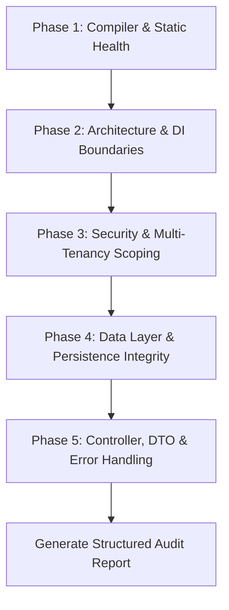

# NestJS Code Quality & Architecture Audit Skill

This skill provides a systematic, multi-dimensional audit workflow for NestJS applications. It helps identify structural decay, security flaws, type safety gaps, unhandled edge cases, and redundant/orphaned code.

---

## 1. Audit Execution Workflow

Follow this 5-phase procedure when analyzing a NestJS codebase:



### Phase 1: Compiler & Static Health Check
1. **Type Checking**: Run `pnpm exec tsc --noEmit` in the backend directory.
2. **Missing Type Declarations**: Check for `@types/*` mismatches, missing declarations (e.g., `passport`, `multer`, `express-session`), and `any` leakages.
3. **Environment & Secrets Typing**: Verify that `process.env` accesses are guarded against `undefined` and properly validated via `@nestjs/config`.
4. **Quick Automated Scan**: Run the automated audit helper:
   ```bash
   bash .agents/skills/nestjs-code-audit/scripts/quick-audit.sh
   ```

### Phase 2: Architecture & Dependency Injection Boundaries
1. **God Service Detection**: Flag services exceeding 300+ lines or combining multiple domains (e.g., AI prompting + database transactions + file parsing).
2. **Module Encapsulation**: Verify that each module cleanly exports only what is needed and imports only what it consumes.
3. **Circular Dependencies**: Inspect `forwardRef()` usages and cyclical imports.
4. **Singleton vs Request Scoping**: Ensure stateful data is never stored in singleton service properties (which causes data leaks across concurrent requests).

### Phase 3: Security & Multi-Tenancy Scoping
1. **User Scoping on All Queries**: In multi-user apps, verify EVERY Prisma/TypeORM query on user-owned entities contains `{ where: { userId } }` or equivalent tenant isolation.
2. **Guard Coverage**: Verify `@UseGuards(AuthenticatedGuard)` or JWT guards are present at controller class or method level.
3. **Secret Encryption**: Ensure sensitive credentials (e.g., user LLM API keys) are encrypted at rest using strong AEAD ciphers (e.g., AES-256-GCM) with IV and AuthTag stored, and never leaked in API responses.
4. **Proxy & Session Security**: Check cookie configurations (`httpOnly`, `secure`, `sameSite`, `trust proxy`).

### Phase 4: Data Layer & Persistence Integrity
1. **Serialized JSON String Fields**: For SQLite/databases storing JSON in text columns, check that every read is safely parsed (`JSON.parse` with fallback/validation) and every write is serialized (`JSON.stringify`). Look for unhandled null/undefined values.
2. **Transaction Boundaries**: Ensure multi-step mutations (e.g., delete user data, imports, cascading deletes) use `prisma.$transaction([...])`.
3. **Dead Models & Orphaned Tables**: Check for database models or relations declared in `schema.prisma` that have no corresponding service/controller usage.

### Phase 5: Controller, DTO & Error Handling
1. **DTO & Request Validation**: Inspect controller request payloads. Flag inline types without `class-validator` / `ValidationPipe` enforcement.
2. **Route Prefix Consistency**: Verify all API endpoints follow a standard prefix (e.g., `/api/<resource>`).
3. **Error Handling & Exception Mapping**: Check that services throw NestJS HTTP exceptions (`NotFoundException`, `BadRequestException`, `ForbiddenException`) instead of generic unhandled `throw new Error()`.
4. **Dead Endpoints & Unused Methods**: Match routes against frontend client calls to identify orphaned endpoints.

---

## 2. Structured Audit Output Format

When presenting audit findings, organize results using the following scorecard:

| Dimension | Status (🔴 Critical / 🟡 Warning / 🟢 Healthy) | Key Findings | Impact / Recommendation |
| :--- | :--- | :--- | :--- |
| **Type Safety & Build** | | | |
| **Architecture & Modules** | | | |
| **Multi-Tenancy & Security** | | | |
| **Data Layer & JSON Fields** | | | |
| **DTOs & API Contracts** | | | |
| **Error Handling & Resilience** | | | |
| **Dead & Redundant Code** | | | |

For each critical issue identified, include:
- **File & Line**: `[File.ts:L123](file:///path/to/File.ts#L123)`
- **Symptom & Root Cause**: Why the code fails or causes regressions.
- **Remediation Strategy**: Direct link to the refactoring pattern in [`nestjs-refactoring`](../nestjs-refactoring/SKILL.md).

---

## 3. Reference Documentation

For detailed anti-patterns and deep-dive checklists, consult:
- [Common NestJS Anti-Patterns & Code Smells](./references/common-antipatterns.md)
- [Comprehensive NestJS Audit Checklist](./references/audit-checklist.md)
