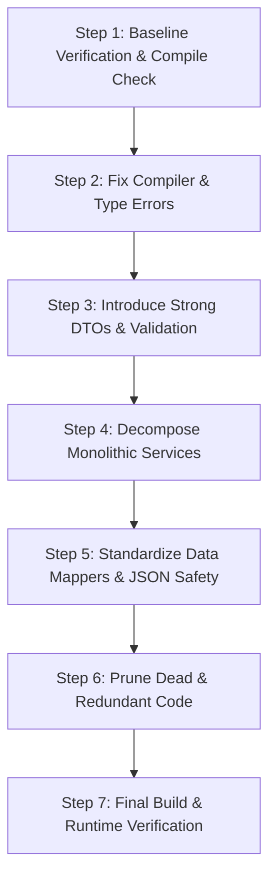

# NestJS Safe Refactoring & Code Modernization Skill

This skill guides the planning and step-by-step execution of safe, zero-regression refactoring for NestJS applications. It enforces incremental changes, strict type safety, domain decoupling, and continuous verification.

---

## 1. Refactoring Core Principles

1. **Never break runtime API contracts**: Endpoint paths, HTTP methods, status codes, and JSON response shapes MUST remain compatible with existing frontend clients unless a planned migration is underway.
2. **Preserve User-Scoped Security**: Every refactored query or handler MUST maintain multi-tenancy isolation (`userId` filtering).
3. **Refactor in Atomic, Verifiable Steps**: One concern per step (e.g. fix compiler errors → extract DTOs → decompose service → clean dead code). Run verification between each step.
4. **Zero Implicit Any**: Introduce strongly-typed interfaces and models at boundaries.

---

## 2. Step-by-Step Refactoring Workflow

### Step 1: Baseline Verification
Before touching code:
1. Run `pnpm exec tsc --noEmit` in the backend.
2. Catalog existing routes and service entry points that will be affected.
3. Note any frontend API callers using `services/api.ts` to guarantee backward compatibility.

### Step 2: Fix Compiler & Type Errors
1. Resolve missing `@types/*` dependencies (e.g., `@types/passport`, `@types/multer`).
2. Fix nullable safety warnings (e.g., `Array.reduce` over nullable array elements, optional chaining).
3. Ensure all environment variable usages (`process.env.VAR`) handle `undefined` values with explicit checks or defaults.

### Step 3: Introduce Strong DTOs & Validation
1. Replace inline controller request types with validated class DTOs.
2. Apply `class-validator` decorators (`@IsString()`, `@IsNotEmpty()`, `@IsOptional()`, `@IsInt()`, etc.).
3. Apply `class-transformer` decorators (`@Type(() => Number)`) for query parameters or nested structures.
4. Verify global or controller-level `ValidationPipe({ whitelist: true, transform: true })`.
- 📖 Reference: [DTO Validation Recipes](./references/dto-validation-recipes.md)

### Step 4: Decompose Monolithic Services
When a service exceeds single responsibility or 300+ lines:
1. **Identify domain boundaries** (e.g., AI prompt generation vs. database CRUD vs. file upload handling).
2. **Extract sub-services or domain helpers** without breaking existing module imports.
3. **Register new sub-services** in the feature module's `providers` and `exports`.
4. **Delegate from the parent service** or inject new sub-services into controllers.
- 📖 Reference: [Service Decomposition Patterns](./references/service-decomposition.md)

### Step 5: Standardize Data Mappers & JSON Safety
1. Centralize serialized JSON field serialization and deserialization (e.g., Prisma SQLite `String` fields storing JSON).
2. Use safe parsing helpers with typed fallbacks to prevent runtime crashes from legacy or corrupted rows.
3. Ensure all multi-step mutations are wrapped in `prisma.$transaction([...])`.

### Step 6: Prune Dead & Redundant Code
1. Remove orphaned methods, unused imports, and obsolete helper functions.
2. Remove commented-out legacy code blocks.
3. Consolidate duplicate helper logic across modules into shared utility functions.

### Step 7: Final Build & Runtime Verification
1. Run `pnpm exec tsc --noEmit` to ensure 0 TypeScript errors.
2. Run `pnpm build` to verify production bundling.
3. Verify running dev server (`pnpm start:dev`) reloads without DI or bootstrap errors.

---

## 3. Reference Documentation

- [Safe Refactoring Guide & Best Practices](./references/safe-refactoring-guide.md)
- [Service Decomposition Patterns](./references/service-decomposition.md)
- [DTO Validation Recipes & Examples](./references/dto-validation-recipes.md)
