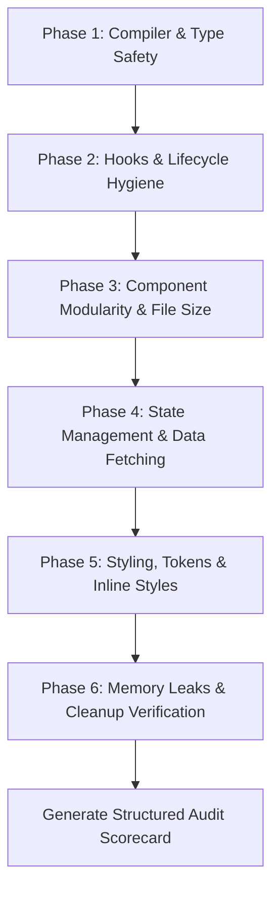

# React Code Quality & Architecture Audit Skill

This skill provides a systematic, multi-dimensional audit workflow for React and Vite applications. It detects structural decay, re-render loops, unhandled edge cases, memory leaks, and styling anti-patterns.

---

## 1. Audit Execution Workflow

Follow this 6-phase procedure when analyzing the frontend codebase:



### Phase 1: Compiler & Type Safety Check
1. Run `pnpm --filter language-learner-frontend exec tsc --noEmit`.
2. Check for `any` types, missing interface definitions, or loose casting (`as any`).
3. Check for unsafe property accesses on nullable values without optional chaining (`?.`).
4. Run the automated audit helper:
   ```bash
   bash .agents/skills/react-code-audit/scripts/quick-audit.sh
   ```

### Phase 2: Hooks & Lifecycle Hygiene
1. **Hook Dependency Arrays**: Check all `useEffect`, `useCallback`, and `useMemo` hooks for missing dependencies or stale closures.
2. **Infinite Loop Hazards**: Look for `useEffect` hooks updating state that triggers their own re-execution without stable conditionals.
3. **Derived State in Effects**: Flag `useEffect` hooks used merely to copy props to local state (which causes double-renders and sync bugs).

### Phase 3: Component Modularity & File Size
1. **Mega-Component Detection**: Flag any `.tsx` component exceeding **250+ lines**.
2. **Prop Drilling & God Components**: Identify components passing >5 props down multiple levels without composition.
3. **Colocation Violations**: Flag feature-specific sub-components placed in global folders or monolithic single-file pages.

### Phase 4: State Management & Data Fetching
1. **Raw Axios Calls**: Flag components making raw `axios` HTTP calls instead of using centralized `services/api.ts` and TanStack Query hooks.
2. **Missing Async UI States**: Check if data-fetching components omit loading spinners, error alerts, or empty states.
3. **Uncached Redundant Fetches**: Flag identical API endpoints called independently in multiple child components without a shared query cache.

### Phase 5: Styling & Design Tokens Hygiene
1. **Inline Style Detection**: Flag instances of `style={{ ... }}` used for layout, colors, or typography.
2. **Hardcoded Colors**: Find raw hex codes (`#111827`, `#6366f1`) in JSX or CSS instead of `var(--bg-card)`, `var(--accent-primary)`.
3. **Responsive Breakpoints**: Inspect layout containers for missing mobile responsiveness.

### Phase 6: Memory Leaks & Teardown Verification
1. **Uncleaned Timers / Listeners**: Verify `setTimeout`, `setInterval`, `addEventListener`, or `ResizeObserver` return cleanup functions in `useEffect`.
2. **Uncancelled Async Requests**: Check for async operations updating state after component unmount.

---

## 2. Structured Audit Output Scorecard

When presenting audit findings, organize results using the standard scorecard:

| Dimension | Status (🔴 Critical / 🟡 Warning / 🟢 Healthy) | Key Findings | Impact & Remediation Strategy |
| :--- | :--- | :--- | :--- |
| **Type Safety & Build** | | | |
| **Hook Hygiene & Lifecycles** | | | |
| **Component Size & Modularity** | | | |
| **State & Server Caching** | | | |
| **UI Styling & Tokens** | | | |
| **Memory Leaks & Teardowns** | | | |

For each critical finding, report:
- **File & Line**: `[File.tsx:L123](file:///path/to/File.tsx#L123)`
- **Symptom & Root Cause**: Why the pattern is hazardous.
- **Remediation Pattern**: Reference the corresponding section in [`react-refactoring`](../react-refactoring/SKILL.md) or [`react-component-architecture`](../react-component-architecture/SKILL.md).

---

## 3. Reference Documentation

- [Frontend Audit Checklist & Code Smell Catalog](./references/audit-checklist.md)
