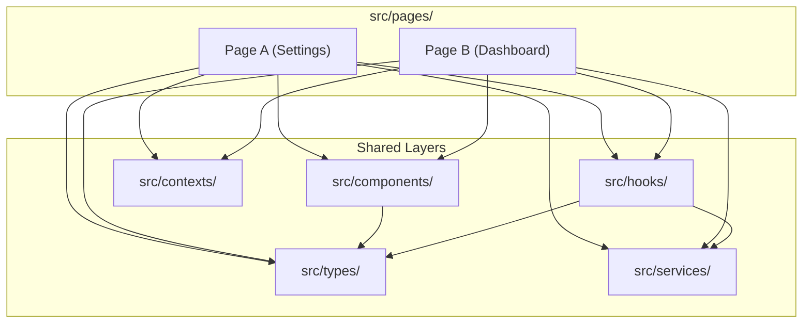

# Directory Structure & Module Boundary Guide

This document outlines detailed rules for folder structures, boundary isolation, and feature modularity in React + Vite projects.

---

## 1. Page Feature Folder Anatomy

Every routable page without exception MUST be structured as its own dedicated folder with `index.tsx`:

```
src/pages/WordBank/
├── components/
│   ├── WordList.tsx          # Presentational list renderer
│   ├── WordCard.tsx          # Presentational individual word card
│   ├── WordFilterBar.tsx     # Search and filter controls
│   └── WordEditModal.tsx     # Add/Edit word modal dialog
├── hooks/
│   ├── useWordBankQueries.ts # TanStack Query wrappers for words
│   └── useWordFilters.ts     # Search, filter, and sort state
├── WordBank.css              # Styles scoped to WordBank page
├── types.ts                  # Local UI types (e.g. WordFilterState)
└── index.tsx                 # Routable page component (orchestrator)
```

---

## 2. Shared Component Anatomy

When a UI component is promoted to `src/components/`, structure it in its own folder:

```
src/components/Modal/
├── Modal.tsx                 # Core component logic & DOM structure
├── Modal.css                 # Component-specific styles
└── index.ts                  # Public barrel export: `export * from './Modal'`
```

---

## 3. Boundary Rules & Dependency Graph



### Prohibited Cross-Module Imports:
- ❌ `src/pages/Dashboard/` importing directly from `src/pages/Settings/components/`
- ❌ `src/components/` importing from `src/pages/` (Shared components must never depend on specific pages)
- ❌ Circular imports between services and hooks

---

## 4. Barrel File (`index.ts`) Best Practices

- Use `index.ts` only for directory entry points to provide clean imports.
- Avoid massive nested barrel re-exports that import the entire app into a single tree (which harms tree-shaking and Vite dev server HMR performance).
- Prefer direct path imports or single-level barrel exports:
  ```typescript
  // ✅ Clean single-level import
  import { Modal } from '../../components/Modal';
  import { useDebounce } from '../../hooks/useDebounce';
  ```
