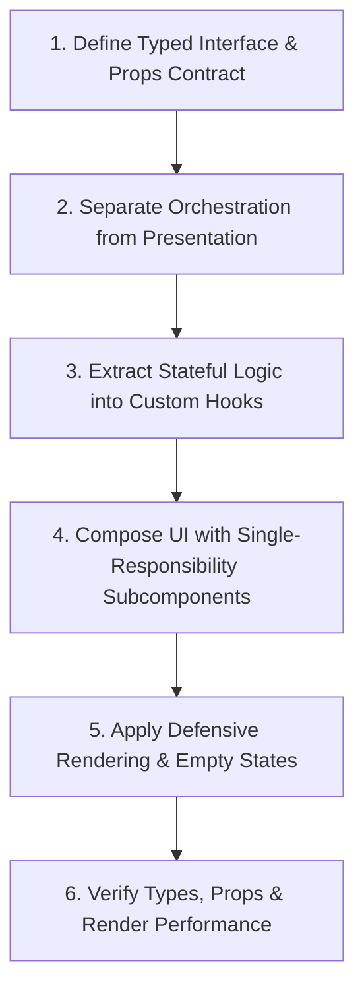

# React Component Architecture & Design Patterns Skill

This skill defines the component lifecycle, structural design patterns, and engineering standards for writing clean, performant, and maintainable React 19 / TypeScript components in Vite applications.

---

## 1. Component Construction Lifecycle

When implementing or decomposing any React component or page, follow this 6-step lifecycle:



### Step 1: Explicit Props Contracts
- Every component must declare a dedicated, exported TypeScript interface for its props.
- Never use inline anonymous object types for props exceeding 2 properties.
- Prefix boolean flags with clear auxiliary verbs (`isOpen`, `isLoading`, `hasError`, `canSubmit`).
- Strongly type event callbacks:
  ```typescript
  export interface WordCardProps {
    word: Word;
    isSelected?: boolean;
    onSelect: (wordId: string) => void;
    onDelete?: (wordId: string) => Promise<void>;
  }
  ```

### Step 2: Container / Presentational Separation
- **Page / Container Components**: Handle routing params, context consumption, server state queries/mutations, and high-level layout. Keep JSX lean and declarative.
- **Presentational / Dumb Components**: Pure functions of their props. Handle visual rendering, interaction animations, and delegating events upwards.
- Avoid passing raw event dispatchers or complex mutation handlers deep down tree levels; wrap them in semantic callback props.

### Step 3: Extract Stateful Logic to Custom Hooks
- When a component contains >2 `useState` hooks, complex `useEffect` side effects, or extensive form logic, extract it into a dedicated hook (e.g. `useSettingsForm`, `useLessonSession`).
- Colocate the hook in the component's `hooks/` subdirectory if private to the feature, or `src/hooks/` if shared.
- Return structured, typed objects from custom hooks:
  ```typescript
  export function useLessonTimer(initialSeconds: number) {
    const [secondsLeft, setSecondsLeft] = useState(initialSeconds);
    const [isActive, setIsActive] = useState(false);
    // ... timer logic & cleanup
    return { secondsLeft, isActive, startTimer, pauseTimer, resetTimer };
  }
  ```

### Step 4: Component Decomposition & Size Limit
- **Strict Size Limit**: Keep individual component files under **250 lines**.
- When a page or card starts exceeding this limit or nesting multiple tabs/sections, slice it into dedicated sub-components in a `components/` subfolder.
- Prefer **Composition** (`children` prop or slots) over boolean prop flags that alter half of a component's JSX structure.

### Step 5: Defensive Rendering & Empty States
- Always handle `loading`, `error`, `empty`, and `success` states explicitly.
- Guard list rendering with null checks and explicit fallback cards when arrays are empty:
  ```tsx
  {words.length === 0 ? (
    <EmptyState message="No words found matching your query." />
  ) : (
    words.map(word => <WordCard key={word.id} word={word} />)
  )}
  ```
- **Never use array indices as `key`** for lists that can be filtered, sorted, added, or deleted. Always use unique database IDs or persistent identifiers.

### Step 6: On-The-Spot "Definition of Done"
Before concluding work on any component:
1. Run `pnpm --filter language-learner-frontend exec tsc --noEmit` (0 errors).
2. Check for missing prop types, implicit `any`, or unused variables.
3. Verify that all interactive elements have accessible labels (`aria-label` or visible text).
4. Verify responsive layout down to mobile screens (375px).

---

## 2. Reference Documentation

- [Advanced Component Patterns & Memoization Rules](./references/component-patterns.md)
