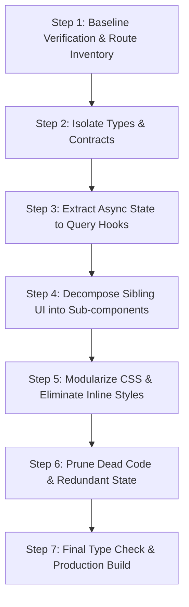

# React Safe Refactoring & Code Modernization Skill

This skill guides the safe, regression-free decomposition and modernization of React components and pages. It enforces incremental migration, strict type safety, modular colocation, and continuous verification.

---

## 1. Refactoring Core Principles

1. **Zero UX / Visual Regressions**: Refactoring must improve code structure, type safety, and maintainability without altering user-facing functionality or breaking existing styles.
2. **Preserve API Contracts**: Ensure all network calls continue to adhere to backend payload and query shapes.
3. **Decompose in Atomic, Verifiable Steps**: One concern per step (e.g. extract types → extract custom hook → extract sub-components → modularize CSS → remove dead code). Run verification between every step.
4. **Strict Type Safety**: Never introduce `any` or loose type assertions during refactoring.

---

## 2. Step-by-Step Refactoring Workflow

### Step 1: Baseline Verification
Before editing any code:
1. Run `pnpm --filter language-learner-frontend exec tsc --noEmit` to confirm a clean baseline.
2. Map out all user flows, modals, and conditional tabs within the target file.

### Step 2: Isolate Types & Contracts
1. Create a `types.ts` file in the feature directory (e.g., `src/pages/Settings/types.ts`).
2. Move form state types, section tab enums, and local payload interfaces into this file.
3. Export interfaces with descriptive names.

### Step 3: Extract Async State & Logic to Custom Hooks
1. Create `hooks/` in the feature folder (e.g., `src/pages/Settings/hooks/useSettingsForm.ts`).
2. Move `useState`, form validation, submit handlers, and TanStack Query mutations into the hook.
3. Expose a clean, structured object of values and handler functions.

### Step 4: Decompose Sibling UI into Sub-components
1. Create `components/` in the feature folder (e.g. `src/pages/Settings/components/`).
2. Extract each major visual block (e.g., `AiConfigSection.tsx`, `ImportExportSection.tsx`, `AccountSection.tsx`) into its own file under 200 lines.
3. Pass only necessary props via explicit interfaces.
4. Keep the main `index.tsx` as a clean orchestrator.

### Step 5: Modularize CSS & Eliminate Inline Styles
1. Create `<FeatureName>.css` in the feature folder (e.g. `Settings.css`).
2. Replace all inline `style={{ ... }}` objects with semantic CSS classes referencing design tokens (`var(--bg-card)`, `var(--accent-primary)`).
3. Import the CSS file at the top of the feature's `index.tsx`.

### Step 6: Prune Dead Code & Redundant State
1. Remove unused imports, dead variables, orphaned state setters, and leftover `console.log` calls.
2. Remove commented-out legacy code blocks.

### Step 7: Final Build & Verification
1. Run `pnpm --filter language-learner-frontend exec tsc --noEmit`.
2. Run `pnpm --filter language-learner-frontend build`.
3. Test all tabs, forms, and buttons in the browser to ensure zero regression.

---

## 3. Reference Documentation

- [Step-by-Step Mega-Component Decomposition Playbook](./references/safe-refactoring-guide.md)
