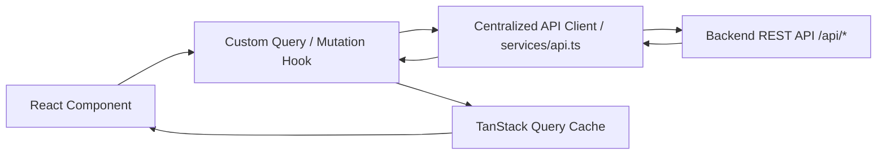

# React State & Data Fetching Skill (TanStack Query + Axios)

This skill defines the architecture for handling client state, global context, and server state caching using TanStack Query (React Query) and centralized Axios services.

---

## 1. State Categorization Framework

Never mix server state, client UI state, and global session state:

| State Category | Purpose | Recommended Tool | Example |
| :--- | :--- | :--- | :--- |
| **Server State** | Data originating from & persisted in backend DB | TanStack Query (`useQuery`, `useMutation`) | Lessons, Words, Rules, Settings |
| **Local UI State** | Ephemeral, component-specific interaction | `useState`, `useReducer` | Modal open/close, active tab, hover |
| **Global Client State** | App-wide cross-cutting configuration | React Context | `AuthContext` (User session), `LanguageContext` |
| **URL State** | State that should survive page reload or sharing | React Router search params (`useSearchParams`) | Active filter queries, pagination, search term |

---

## 2. Server State Architecture with TanStack Query



### Step 1: Centralized Query Keys
Always define and export standardized query keys in `src/services/queryKeys.ts` to prevent typos and enable precise cache invalidation:

```typescript
export const queryKeys = {
  dashboard: ['dashboard', 'stats'] as const,
  lessons: {
    all: ['lessons'] as const,
    list: (filters?: { status?: string; q?: string }) => ['lessons', 'list', filters] as const,
    detail: (id: string) => ['lessons', 'detail', id] as const,
    proposals: (refresh?: boolean) => ['lessons', 'proposals', { refresh }] as const,
  },
  words: {
    all: ['words'] as const,
    list: (search?: string) => ['words', 'list', { search }] as const,
  },
  rules: {
    all: ['rules'] as const,
    list: (search?: string) => ['rules', 'list', { search }] as const,
  },
  settings: ['settings'] as const,
};
```

### Step 2: Custom Query Hook Pattern
Wrap raw `useQuery` calls in feature-specific or domain-specific custom hooks:

```typescript
import { useQuery } from '@tanstack/react-query';
import { api } from '../services/api';
import { queryKeys } from '../services/queryKeys';

export function useLessons(filters?: { status?: string; q?: string }) {
  return useQuery({
    queryKey: queryKeys.lessons.list(filters),
    queryFn: () => api.getLessons(filters),
    staleTime: 1000 * 60 * 5, // 5 minutes
  });
}

export function useLesson(id: string) {
  return useQuery({
    queryKey: queryKeys.lessons.detail(id),
    queryFn: () => api.getLessonById(id),
    enabled: Boolean(id),
  });
}
```

### Step 3: Mutation & Cache Invalidation Pattern
Always handle mutations with query invalidation or optimistic UI updates:

```typescript
import { useMutation, useQueryClient } from '@tanstack/react-query';
import { api } from '../services/api';
import { queryKeys } from '../services/queryKeys';

export function useDeleteLesson() {
  const queryClient = useQueryClient();

  return useMutation({
    mutationFn: (id: string) => api.deleteLesson(id),
    onSuccess: () => {
      // Invalidate both the list and dashboard stats
      queryClient.invalidateQueries({ queryKey: queryKeys.lessons.all });
      queryClient.invalidateQueries({ queryKey: queryKeys.dashboard });
    },
    onError: (error) => {
      console.error('Failed to delete lesson:', error);
    },
  });
}
```

---

## 3. Handling Async UI States Gracefully

Every component consuming asynchronous data must handle all 4 states explicitly:

```tsx
export const WordBankList = () => {
  const { data: words, isPending, isError, error, refetch } = useWords();

  if (isPending) {
    return <LoadingSpinner message="Loading word bank..." />;
  }

  if (isError) {
    return (
      <ErrorAlert
        message={error instanceof Error ? error.message : 'Failed to load words'}
        onRetry={() => refetch()}
      />
    );
  }

  if (!words || words.length === 0) {
    return <EmptyState title="No words found" description="Start a lesson to add vocabulary." />;
  }

  return (
    <div className="word-grid">
      {words.map(word => (
        <WordCard key={word.id} word={word} />
      ))}
    </div>
  );
};
```

---

## 4. Reference Documentation

- [TanStack Query Advanced Patterns & Optimistic Updates](./references/tanstack-query-patterns.md)
