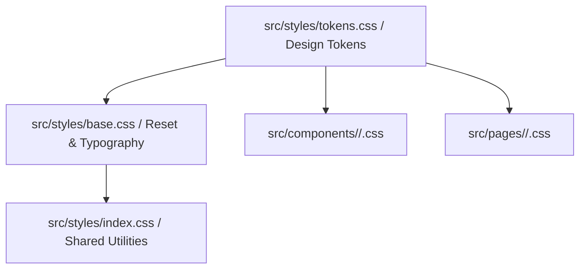

# React UI Styling & Design System Skill (Vanilla CSS & Glassmorphism)

This skill defines the styling architecture, CSS token usage, responsive layout patterns, and visual fidelity standards for the dark glassmorphic design system.

---

## 1. Styling Architecture & Organization

The frontend uses **Modular Vanilla CSS** with **Global Design Tokens**:



### Rule 1: No Inline Styles
- Strictly eliminate `style={{ ... }}` for layout (`display: flex`, `gap`, `padding`), colors, borders, or typography.
- Use semantic CSS classes and modular stylesheets.
- *Permissible exception*: Dynamic runtime values computed in JS (e.g. dynamic canvas coordinates or animated progress percentages `style={{ width: `${percent}%` }}`).

### Rule 2: Modular CSS Colocation
- Place component-specific styles right next to the component (e.g., `src/components/Modal/Modal.css` or `src/pages/WordBank/WordBank.css`).
- Import the stylesheet inside the component file:
  ```typescript
  import './WordBank.css';
  ```
- Prefix component CSS classes with the component scope (e.g., `.word-bank-container`, `.word-card-header`) to prevent accidental style collisions.

---

## 2. Design System Tokens & Glassmorphism Rules

Always reference CSS variables instead of hardcoded hex values:

### Core Color & Background Tokens
| Token | Variable | Value / Usage |
| :--- | :--- | :--- |
| **Dark Background** | `var(--bg-dark)` | `#0b0f19` (App canvas background) |
| **Glass Card Surface** | `var(--bg-card)` | `rgba(17, 24, 39, 0.75)` |
| **Card Border** | `var(--border-card)` | `rgba(255, 255, 255, 0.08)` |
| **Primary Accent** | `var(--accent-primary)`| `#6366f1` (Indigo / Action buttons) |
| **Primary Hover** | `var(--accent-hover)` | `#4f46e5` |
| **Success Accent** | `var(--accent-success)`| `#10b981` (Emerald / Correct answers) |
| **Warning Accent** | `var(--accent-warning)`| `#f59e0b` (Amber / Review needed) |
| **Danger Accent** | `var(--accent-danger)` | `#ef4444` (Rose / Delete & errors) |
| **Glass Blur** | `var(--glass-blur)` | `blur(16px)` |

### Glassmorphic Card Standard Recipe
```css
.glass-card {
  background: var(--bg-card);
  backdrop-filter: var(--glass-blur);
  -webkit-backdrop-filter: var(--glass-blur);
  border: 1px solid var(--border-card);
  border-radius: 1rem;
  box-shadow: 0 8px 32px 0 rgba(0, 0, 0, 0.37);
  transition: transform 0.2s ease, border-color 0.2s ease, box-shadow 0.2s ease;
}

.glass-card:hover {
  border-color: rgba(99, 102, 241, 0.3);
  box-shadow: 0 12px 40px 0 rgba(99, 102, 241, 0.15);
}
```

---

## 3. Responsive Layout Guidelines

- **Mobile First or Fluid Grid**: Use CSS Grid with `repeat(auto-fill, minmax(280px, 1fr))` for card layouts.
- **Breakpoints**:
  - Desktop: `> 1024px`
  - Tablet: `768px - 1024px`
  - Mobile: `< 768px`
- Ensure all tables, grids, and action toolbars wrap cleanly or offer horizontal scroll with touch support on mobile.

---

## 4. Reference Documentation

- [CSS Architecture & Design Tokens Reference](./references/css-architecture-tokens.md)
